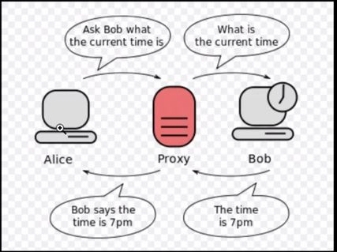

<h1>PROXY SERVER</h1>

Proxy Server is intermediary hardware/software that sits between the client and server.
Used to filter requests
* Log Requests
* Transform request by adding/removing headers
* Encrypting/decrypting or compression

Benefits of using proxy server
* Cache : Which can serve a lot of requests
* It can coordinate requests from multiple servers &  can be used to optimize request traffic.
* It collapse requests for data that is spatially close together in the storage, which we'll decrease request latency.
* Proxies are useful under high load situations or when we have limited caching
* Provides anonymity and may be used to bypass Ip address blocking. 