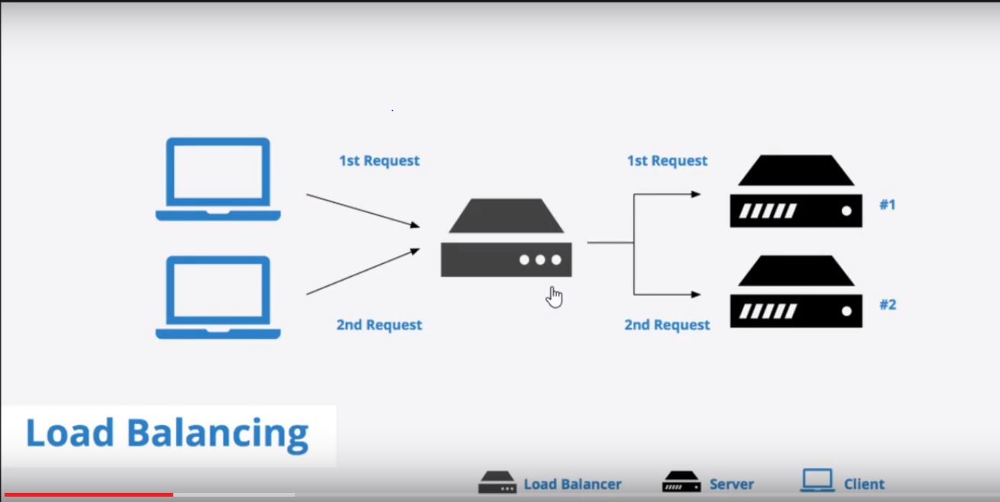

<h1>LOAD BALANCERS</h1>

<b>What is Load Balancer?</b>

* It helps to distribute load across multiple resources
* It also keeps track of status of all the resources while distributing requests. If a server is not available , it 
    stops sending traffic.
    
Load Balancer (LB) is another critical component of any distributed system. It helps to spread the traffic across a cluster of servers to improve responsiveness and availability of applications, websites or databases. LB also keeps track of the status of all the resources while distributing requests. If a server is not available to take new requests or is not responding or has elevated error rate, LB will stop sending traffic to such a server.
    
Typically a load balancer sits between the client and the server accepting incoming network and application traffic and distributing the traffic across multiple backend servers using various algorithms. By balancing application requests across multiple servers, a load balancer reduces individual server load and prevents any one application server from becoming a single point of failure, thus improving overall application availability and responsiveness.

To utilize full scalability and redundancy, we can try to balance the load at each layer of the system. We can add LBs at three places:

Between the user and the web server
Between web servers and an internal platform layer, like application servers or cache servers
Between internal platform layer and database.

Load Balancers where it can be added
* User -Web Server   eg. suppose between user and web ui
* WebServer - Internal Server eg. between web ui and backend spring boot app
* Internal Server - Database

Load Balancer Types
* Hardware LB - Hardware which works as LB, but are very expensive.
* Software LB - 95% companies use this.
                HAProxy 
                
                

Load Balancing Algorithms
* Round Robin 123123
* Round Robin with Weighted Servers
   - Suppose one server has more size, then first two load should be send 
   to that server and then two other server
    112112
* Least Connections
   - Which node has least connections. And that node will get the load
* Least Response Time
   - It figures out on time basis that which node is giving you response very fast
   So Based on their least response time send load to that node.
* Source IP Hash
   - Each call has its own ip, based on the ip we will apply the hashing logic.
* URL Hash
   - Based on the URL we will apply hashing logic
    
**Load Balancing Algorithms
There is a variety of load balancing methods, which use different algorithms best suited for a particular situation.**

Least Connection Method — directs traffic to the server with the fewest active connections. Most useful when there are a large number of persistent connections in the traffic unevenly distributed between the servers.

Least Response Time Method — directs traffic to the server with the fewest active connections and the lowest average response time.

Round Robin Method — rotates servers by directing traffic to the first available server and then moves that server to the bottom of the queue. Most useful when servers are of equal specification and there are not many persistent connections.

IP Hash — the IP address of the client determines which server receives the request.
    
