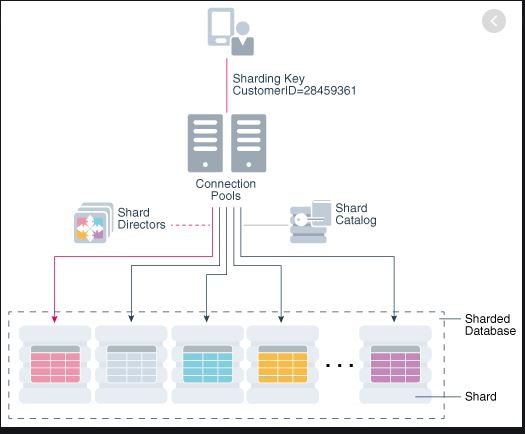

<h1>SHARDING</h1>

Divide your big database into smaller parts.

What is Sharding
* Sharding is a technique to break up a big database into many smaller parts.
* Horizontal Scaling means adding more machines, which is cheaper & more feasible.
* Vertical Scaling means improving servers. -> Not Preferable Increasing GB Size etc

<b>Sharding Methods</b>

* Horizontal Partitioning
    - Putting different rows into different DBs.
    - Range based sharding, i.e. Based on Alphabetically names
    
    Suppose we are storing 4 characters into each db, now a-d are stored into one db, e-h another db.
    Problem is suppose a-d have more data and l-o have less amount of data
    
* Vertical Partitioning
    - Divide tables based of features i.e 1 for user, 1 for location
    
    So Suppose we are storing users in one db, location in another db and photos in another
    Problem is if one db has less data
    

* Directory Based Partitioning
    - We query directory server that holds the mapping between each tuple key to its DB server.

<b>Shading Criteria</b>

* Hash Based  -> MOST USED
    - Using hashcode on any entity value
    
* List Partitioning
    - Based on list i.e. Regions : APAC, EMEA, US    

    Let say Customers we will partition based on region
    Problem is if any region has less data compared to other
    Imbalance in db size
    
* Round-Robin Partitioning
    - One data in one db
    = another data in another db
 
* Composite Partitioning : Combine any above schemes

<b>Sharding Challenges</b>
* ACID Compliance
* Joins Inefficient

