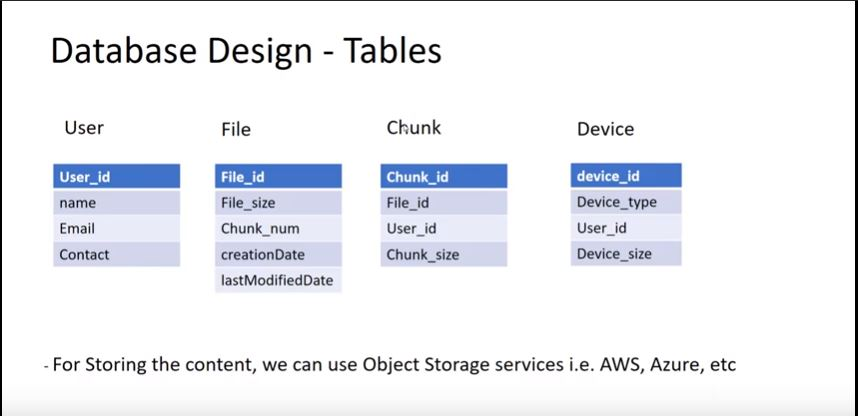
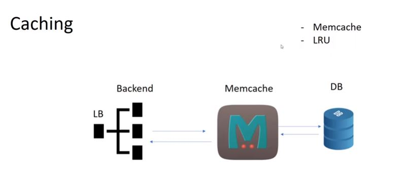

<h1>DROPBOX</h1>

**Requirements:**

User should be able to upload & download content 
It should sync with all devices for a user
User should be able to share content
User should be able to edit the content

**Extended:**

Should limit storage for non-premium user. 
Exposing the service through REST APIs
Analytics: Recording different parameters
Should maintain different versions of a file. 

